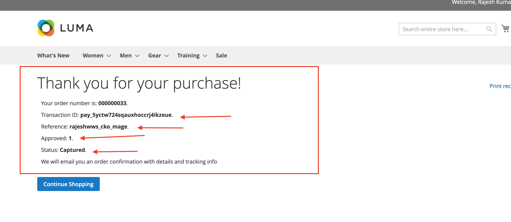

# checkout-magento2-plugin
**Magento 2 plugin using the Checkout.com Unified API. **
Please follow the below step to check this functionally and you can also watch a screen recording that shows the full payment flow 
Screen recording here:
 ( attached video in email as well )  
**Step 1 : Create the plugin files and the Magento admin config. **
the path is : Stores->Configuration->Sales->Payment Methods - you can add the config setting here.

**Step 2 : Code the payment form **
Payment form that will show in the Magento 2 checkout page when the user chooses “CKO test” as a payment method.

**Step 3: Perform the payment request **
Will need to get the token and perform a 3Ds payment request 

**Step 4 GET the transaction status and display summary in the landing page. **
The transaction status and order ID should be displayed in the success page ( landing page). The transaction status should be as per the “approved” parameter in the GET payment details API call.

**After this we can go in the admin and can see the order information will the transaction ID and payment method.  **

